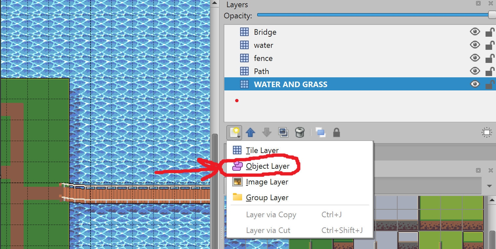
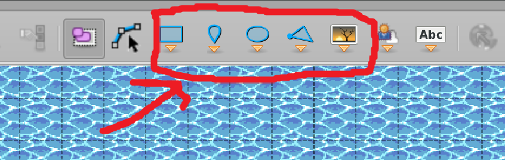
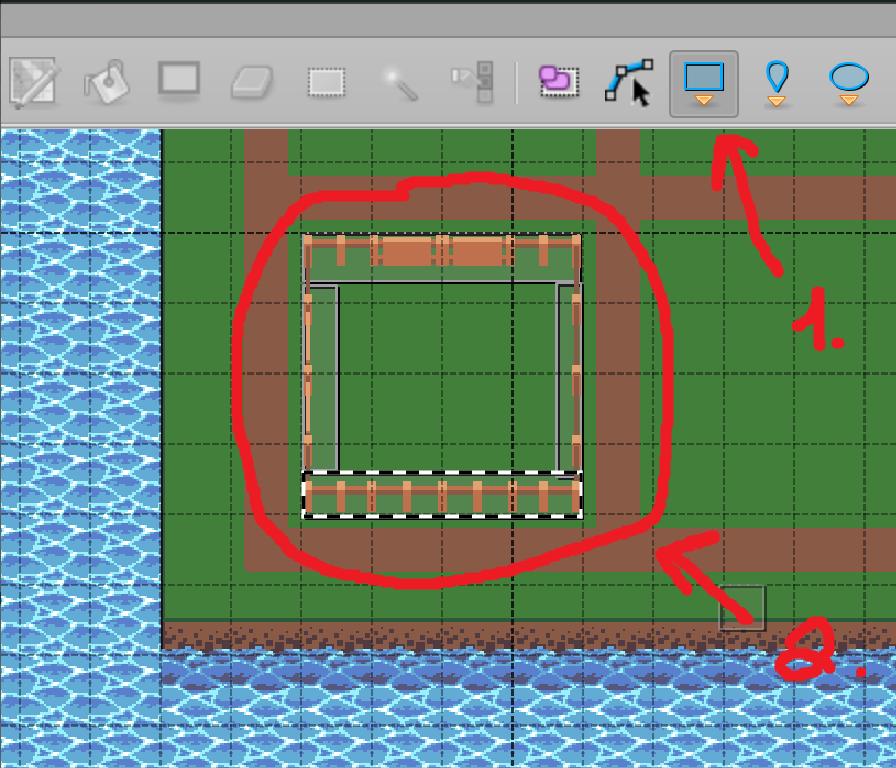
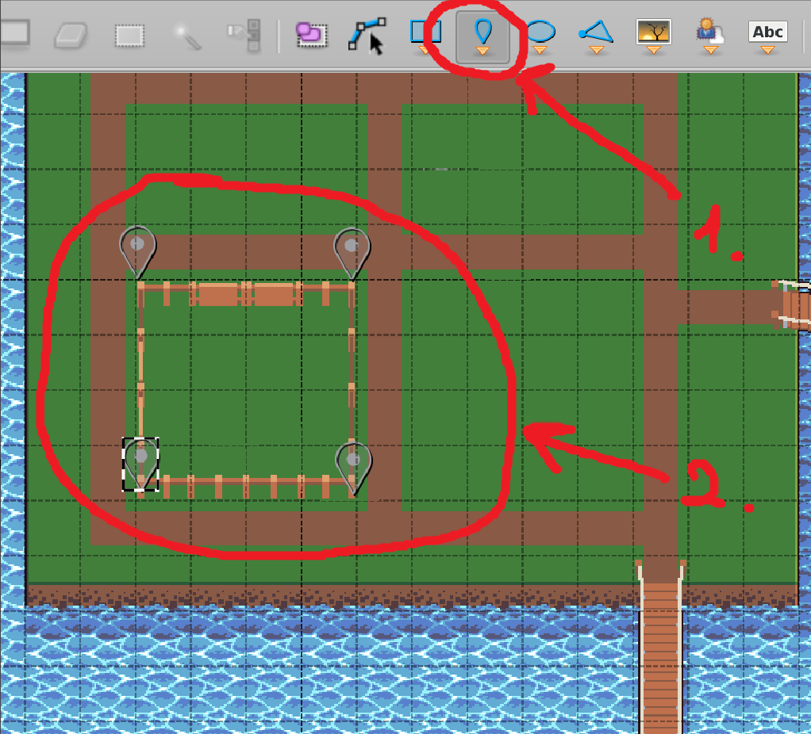
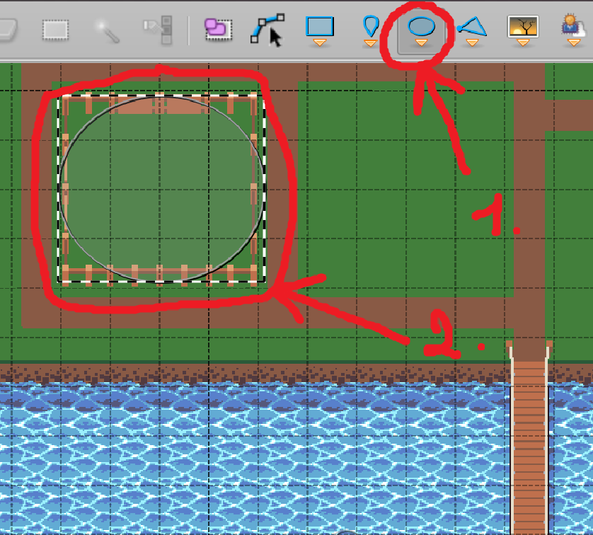
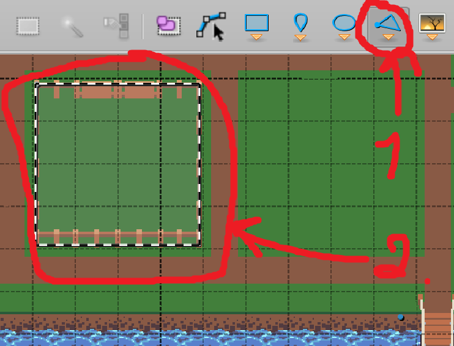
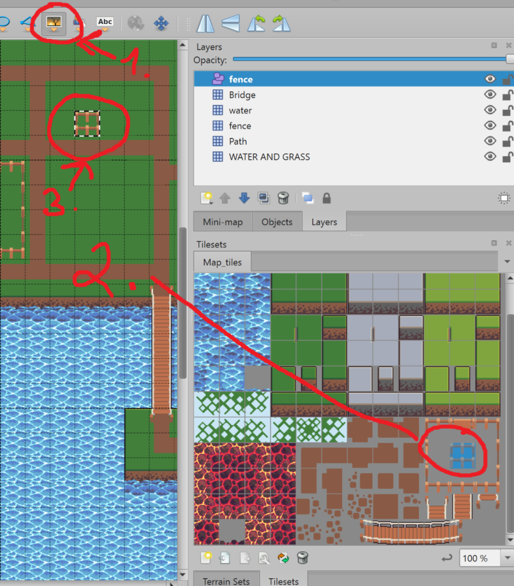

# TiledMap for LibGDX Guide

## What is TiledMap?

Tiled is a 2D level editor that helps you develop the content of your game. Its primary feature is to edit tile maps of various forms, but it also supports free image placement as well as powerful ways to annotate your level with extra information used by the game. Tiled focuses on general flexibility while trying to stay intuitive.


## Getting Started

### Set up a New Project


### Create New Map

1. Create new map by pressing `New Map` in menu
2. Leave `Map` settings by default
3. `Map size` settings may vary, but for the guide we will use 60x34 tiles, so it will be 1920x1088 pixels in size
4. `Tile Size` settings may vary too, but for the guide we will use 32x32. Although, you can use 16x16, 32x32, 64x64, 128x128 etc 
5. Press `OK`


### Add New Tileset

Now we have our plain canvas for the project.
First of all, we need to add new tileset. Press the `New Tileset...` button to add a new tileset.


Now you need to find (or maybe create) the tileset.
To find the tileset you can use different resources.
For example, you can use [craftpix](https://craftpix.net/).
I chose the next [tileset](https://craftpix.net/freebies/free-level-map-pixel-art-assets-pack/) for the guide.
When choosing the tileset, don't forget that you need to pick 32x32 tileset.


And now you have got your uploaded tileset file. Don't touch it and just switch back to the map file.

### Create the Map


Now you can create a map by selecting a tile from the window at the bottom right and draw on the canvas

After you are done, save the file by pressing `CTRL + S` or `COMMAND + S`

## Code part

First of all, create new `TiledMapLoader` class

_TiledMapLoader.java_
```java
public class TiledMapLoader {

    private TiledMap map;

    /**
     * @param path path to the map, starting from /assets folder
     */
    public TiledMapLoader(String path) {
        this.map = new TmxMapLoader().load(path);
    }

    /**
     * @return OrthogonalTiledMapRenderer of the TiledMap
     */
    public OrthogonalTiledMapRenderer setupMap() {
        return new OrthogonalTiledMapRenderer(map);
    }
}
```

Then in your screen class initialize `TiledMapLoader`

_GameScreen.java_
```java
private OrthogonalTiledMapRenderer mapRenderer;

@Override
public void show() {
    mapRenderer = new TiledMapLoader("tiled/map.tmx").setupMap();
}

@Override
public void render(float delta) {
    Gdx.gl.glClearColor(1f, 1f, 1f, 1);
    Gdx.gl.glClear(GL20.GL_COLOR_BUFFER_BIT);
    mapRenderer.render();
}
```

At the moment, it looks bad because the map is somewhere on the bottom left and is partially hidden. So, we need to link our `mapRenderer` to the camera.

_GameScreen.java_
```java
private float worldWidth;
private float worldHeight;

@Override
public void show() {
    camera = new OrthographicCamera();
    mapRenderer = new TiledMapLoader("tiled/map.tmx").setupMap();
    worldWidth = (int) mapRenderer.getMap().getProperties().get("width") * Constants.PPM;
    worldHeight = (int) mapRenderer.getMap().getProperties().get("height") * Constants.PPM;
}


@Override
public void render(float delta) {
    Gdx.gl.glClearColor(1f, 1f, 1f, 1);
    Gdx.gl.glClear(GL20.GL_COLOR_BUFFER_BIT);
    camera.update();
    mapRenderer.setView(camera);
    mapRenderer.render();
}

@Override
public void resize(int width, int height) {
    camera.setToOrtho(false, worldWidth, worldHeight); // Set camera to an orthographic projection and set viewport 
}
```

Next create new class for constants and add `PPM` constant.

_Constants.java_
```java
public class Constants {

    public static final float PPM = 32.0f;
}
```

`PPM (pixels per meter)` defines the scaling factor between your game world's "real-world units" (meters) and screen pixels

And that's it. You have your map beautifully rendered in the game.


## How to parse objects

Static maps are good, but often you need to parse object to make them movable, or create the walls etc

To create these objects, first of all, you need to create an object layer by pressing `Layer -> New -> Object Layer`
And name it `fence`



When `fence` object layer is selected, you can choose between different types of objects
- Rectangle Object (the easiest and the most used one)
- Point Object
- Ellipse Object
- Polygon Object
- Tile object



### Rectangle Object

For the rectangle objects just click on the `Insert Rectangle` or press `R` to switch mode. And just start drawing over the drawing of your map



Parse all existing objects on the map

_TiledMapLoader.java_
```java
/**
 * Parse all objects from all layers of the TiledMap.
 */
public TiledMapLoader parseAllObjects() {
    // iterating all layers
    for (MapLayer mapLayer : map.getLayers()) {
        // iterating all objects in current the layer
        for (MapObject mapObject : mapLayer.getObjects()) {
            // check if current MapObject is instance of RectangleMapObject and cast MapObject to RectangleMapObject
            if (mapObject instanceof RectangleMapObject rectangleMapObject) {
                // get rectangle from RectangleMapObject
                Rectangle rectangle = rectangleMapObject.getRectangle();
                // ...
            }
        }
    }
    return this;
}
```

Or parse by name of the layer

_TiledMapLoader.java_
```java
/**
 * Parse objects from specific layer of the TiledMap.
 *
 * @param layer name of the layer to parse
 */
public TiledMapLoader parseObjectByLayer(String layer) {
    // finding objects from layer by name and iterating
    for (MapObject mapObject : map.getLayers().get(layer).getObjects()) {
        // check if current MapObject is instance of RectangleMapObject and cast MapObject to RectangleMapObject
        if (mapObject instanceof RectangleMapObject rectangleMapObject) {
            // get rectangle from RectangleMapObject
            Rectangle rectangle = rectangleMapObject.getRectangle();
            // ...
        }
    }
    return this;
}
```

And use it in the screen class

_GameScreen.java_
```java
@Override
public void show() {
    camera = new OrthographicCamera();
    mapRenderer = new TiledMapLoader("tiled/map.tmx")
            .parseObjectByLayer("fence")
            // .parseAllObjects()
            .setupMap();
    worldWidth = (int) mapRenderer.getMap().getProperties().get("width") * Constants.PPM;
    worldHeight = (int) mapRenderer.getMap().getProperties().get("height") * Constants.PPM;
}
```

### Point Object

There is no specific class for the Points Object.
Point objects represented as the rectangle objects, but without the height and width (height=0, width=0)

For the point objects just click on the `Insert Point` or press `I` to switch mode. And start putting points



And the code part will be the same.

### Ellipse Object

For the ellipse objects just click on the `Insert Ellipse` or press `C` to switch mode. And just start drawing over the drawing of your map



_TiledMapLoader.java_
```java
/**
 * Parse all objects from all layers of the TiledMap.
 */
public TiledMapLoader parseAllObjects() {
    // iterating all layers
    for (MapLayer mapLayer : map.getLayers()) {
        // iterating all objects in current the layer
        for (MapObject mapObject : mapLayer.getObjects()) {
            // check if current MapObject is instance of EllipseMapObject and cast MapObject to EllipseMapObject
            if (mapObject instanceof EllipseMapObject ellipseMapObject) {
                // get ellipse from EllipseMapObject
                Ellipse ellipse = ellipseMapObject.getEllipse(); 
                // ...
            }
        }
    }
    return this;
}
```

### Polygon Object

For the polygon objects just click on the `Insert Polygon` or press `P` to switch mode. And just start drawing over the drawing of your map



_TiledMapLoader.java_
```java
/**
 * Parse all objects from all layers of the TiledMap.
 */
public TiledMapLoader parseAllObjects() {
    // iterating all layers
    for (MapLayer mapLayer : map.getLayers()) {
        // iterating all objects in current the layer
        for (MapObject mapObject : mapLayer.getObjects()) {
            // check if current MapObject is instance of PolygonMapObject and cast MapObject to PolygonMapObject
            if (mapObject instanceof PolygonMapObject polygonMapObject) {
                // get polygon from PolygonMapObject
                Polygon polygon = polygonMapObject.getPolygon(); 
                // ...
            }
        }
    }
    return this;
}
```

### Tile Object

For the tile objects just click on the `Insert Tile` or press `T` to switch mode. Choose tile in the tileset and put it on the map



_TiledMapLoader.java_
```java
/**
 * Parse all objects from all layers of the TiledMap.
 */
public TiledMapLoader parseAllObjects() {
    for (MapLayer mapLayer : map.getLayers()) { // iterating all layers
        for (MapObject mapObject : mapLayer.getObjects()) { // iterating all objects in current the layer
            if (mapObject instanceof TiledMapTileMapObject tiledMapTileMapObject) { // check if current MapObject is instance of TiledMapTileMapObject and cast MapObject to TiledMapTileMapObject
                float x = tiledMapTileMapObject.getX();
                float y = tiledMapTileMapObject.getY();
                TextureRegion textureRegion = tiledMapTileMapObject.getTextureRegion();
                // use variables to draw SpriteBatch
            }
        }
    }
    return this;
}
```

### All objects together

Sometimes you need to combine objects types

_TiledMapLoader.java_
```java
/**
 * Parse all objects from all layers of the TiledMap.
 */
public TiledMapLoader parseAllObjects() {
    for (MapLayer mapLayer : map.getLayers()) { // iterating all layers
        for (MapObject mapObject : mapLayer.getObjects()) { // iterating all objects in current the layer
            if (mapObject instanceof RectangleMapObject rectangleMapObject) { // check if current MapObject is instance of RectangleMapObject and cast MapObject to RectangleMapObject
                Rectangle rectangle = rectangleMapObject.getRectangle(); // get rectangle from RectangleMapObject
                // ...
            } else if (mapObject instanceof EllipseMapObject ellipseMapObject) { // check if current MapObject is instance of EllipseMapObject and cast MapObject to EllipseMapObject
                Ellipse ellipse = ellipseMapObject.getEllipse(); // get ellipse from EllipseMapObject
                // ...
            } else if (mapObject instanceof PolygonMapObject polygonMapObject) { // check if current MapObject is instance of PolygonMapObject and cast MapObject to PolygonMapObject
                Polygon polygon = polygonMapObject.getPolygon(); // get polygon from PolygonMapObject
                // ...
            } else if (mapObject instanceof TiledMapTileMapObject tiledMapTileMapObject) { // check if current MapObject is instance of TiledMapTileMapObject and cast MapObject to TiledMapTileMapObject
                float x = tiledMapTileMapObject.getX();
                float y = tiledMapTileMapObject.getY();
                TextureRegion textureRegion = tiledMapTileMapObject.getTextureRegion();
                // use variables to draw SpriteBatch
            }
        }
    }
    return this;
}
```

You can make it using `switch` too. Final variant by me:

_TiledMapLoader.java_
```java
/**
 * Parse objects from specific layer of the TiledMap.
 *
 * @param layer name of the layer to parse
 */
public TiledMapLoader parseObjectByLayer(String layer) {
    for (MapObject mapObject : map.getLayers().get(layer).getObjects()) { // finding objects from layer by name and iterating
        handleMapObject(mapObject);
    }
    return this;
}

/**
 * Parse all objects from all layers of the TiledMap.
 */
public TiledMapLoader parseAllObjects() {
    for (MapLayer mapLayer : map.getLayers()) { // iterating all layers
        for (MapObject mapObject : mapLayer.getObjects()) { // iterating all objects in current the layer
            handleMapObject(mapObject);
        }
    }
    return this;
}
    
/**
 * Handle object according to its type
 *
 * @param mapObject map object to handle
 */
public void handleMapObject(MapObject mapObject) {
    switch (mapObject) {
        case RectangleMapObject object -> { // If object is instance of RectangleMapObject
            Rectangle rectangle = object.getRectangle(); // get rectangle from RectangleMapObject
            // ...
        }
        case EllipseMapObject object -> { // If object is instance of EllipseMapObject
            Ellipse ellipse = object.getEllipse(); // get ellipse from EllipseMapObject
            // ...
        }
        case PolygonMapObject object -> { // If object is instance of PolygonMapObject
            Polygon polygon = object.getPolygon(); // get polygon from PolygonMapObject
            // ...
        }
        case TiledMapTileMapObject object -> { // If object is instance of TiledMapTileMapObject
            float x = object.getX();
            float y = object.getY();
            TextureRegion textureRegion = object.getTextureRegion();
            // use variables to draw SpriteBatch
        }
        default -> System.out.println("Some other type");
    }
}
```

_GameScreen.java_
```java
@Override
public void show() {
    camera = new OrthographicCamera();
    mapRenderer = new TiledMapLoader("tiled/map.tmx")
        .parseObjectByLayer("fence")
        // .parseAllObjects()
        .setupMap();
    worldWidth = (int) mapRenderer.getMap().getProperties().get("width") * Constants.PPM;
    worldHeight = (int) mapRenderer.getMap().getProperties().get("height") * Constants.PPM;
}
```
