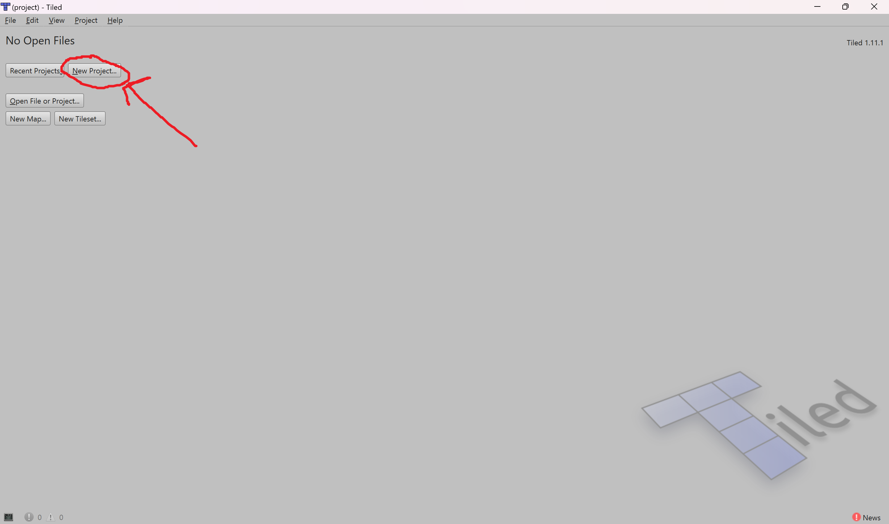
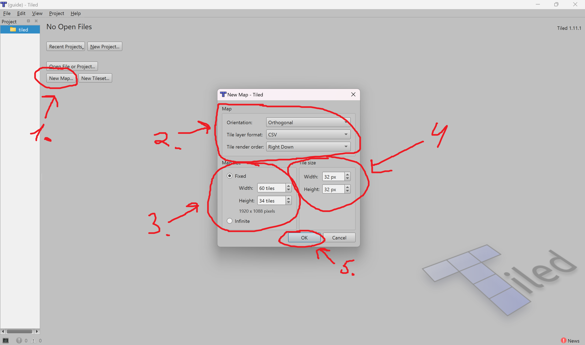
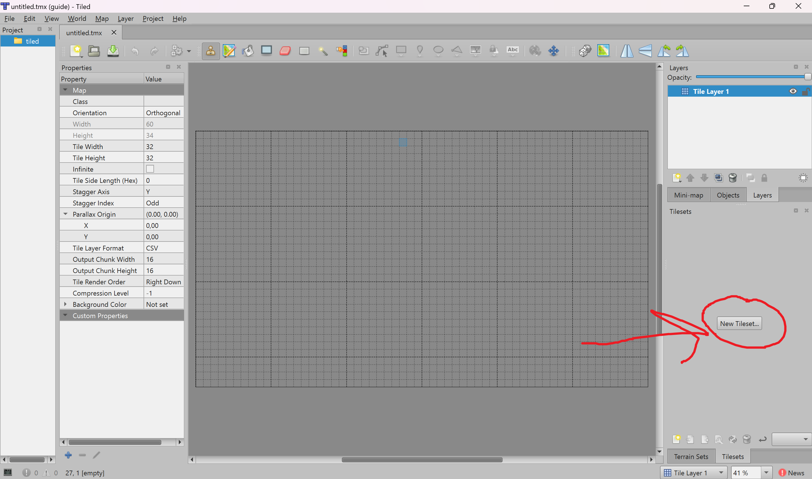
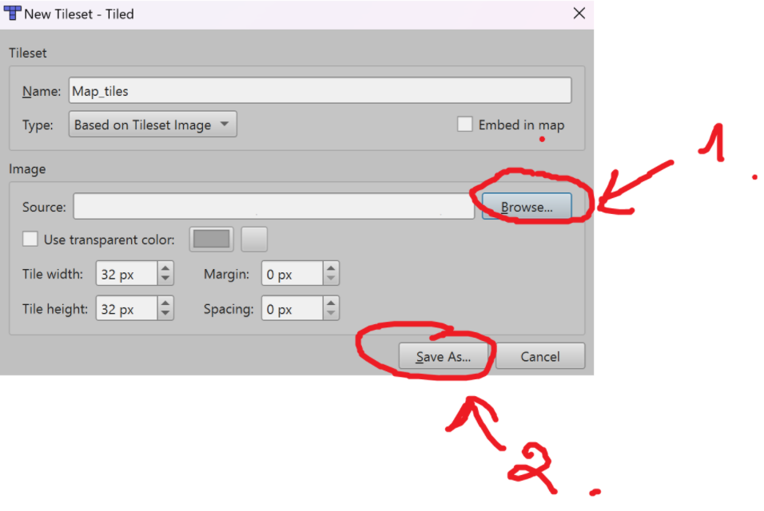
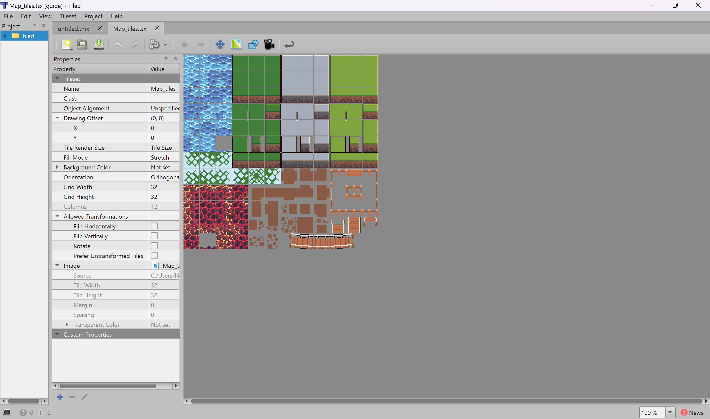
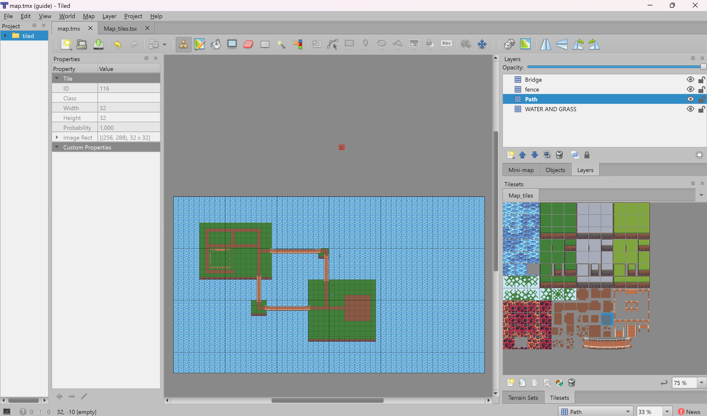
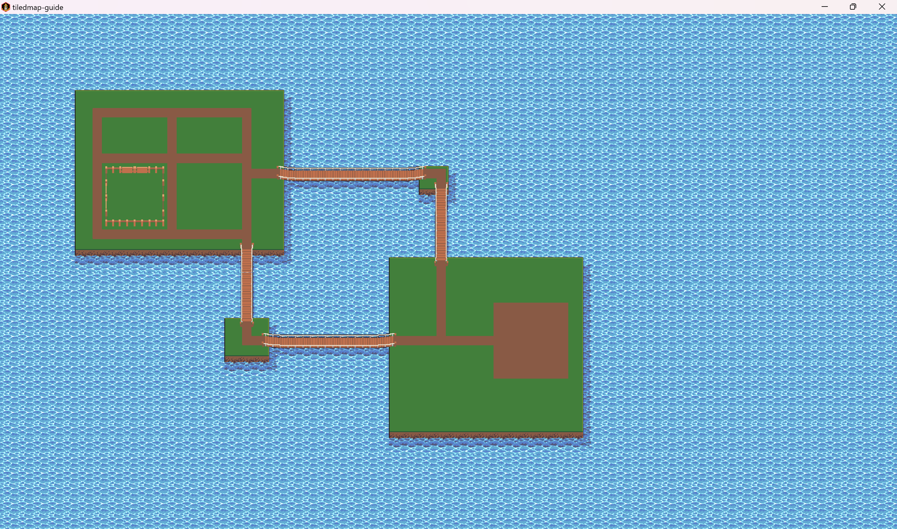

# TiledMap for LibGDX Guide

## What is TiledMap?

Tiled is a 2D level editor that helps you develop the content of your game. Its primary feature is to edit tile maps of various forms, but it also supports free image placement as well as powerful ways to annotate your level with extra information used by the game. Tiled focuses on general flexibility while trying to stay intuitive.


## Getting Started

### Set up a New Project



### Create New Map

1. Create new map by pressing `New Map` in menu
2. Leave `Map` settings by default
3. `Map size` settings may vary, but for the guide we will use 60x34 tiles, so it will be 1920x1088 pixels in size
4. `Tile Size` settings may vary too, but for the guide we will use 32x32. Although, you can use 16x16, 32x32, 64x64, 128x128 etc 
5. Press `OK`



### Add New Tileset

Now we have our plain canvas for the project.
First of all, we need to add new tileset. Press the `New Tileset...` button to add a new tileset.



Now you need to find (or maybe create) the tileset.
To find the tileset you can use different resources.
For example, you can use [craftpix](https://craftpix.net/).
I chose the next [tileset](https://craftpix.net/freebies/free-level-map-pixel-art-assets-pack/) for the guide.
When choosing the tileset, don't forget that you need to pick 32x32 tileset.





And now you have got your uploaded tileset file. Don't touch it and just switch back to the map file.

### Create the Map



Now you can create a map by selecting a tile from the window at the bottom right and draw on the canvas

After you are done, save the file by pressing `CTRL + S` or `COMMAND + S`

## Code part

First of all, create new `TiledMapLoader` class

```java
public class TiledMapLoader {

    private TiledMap map;

    /**
     * @param path path to the map, starting from /assets folder
     */
    public TiledMapLoader(String path) {
        this.map = new TmxMapLoader().load(path);
    }

    /**
     * @return OrthogonalTiledMapRenderer of the TiledMap
     */
    public OrthogonalTiledMapRenderer setupMap() {
        return new OrthogonalTiledMapRenderer(map);
    }
}
```

Then in your screen class initialize `TiledMapLoader`

```java
    private OrthogonalTiledMapRenderer mapRenderer;

    @Override
    public void show() {
        mapRenderer = new TiledMapLoader("tiled/map.tmx").setupMap();
    }

    @Override
    public void render(float delta) {
        Gdx.gl.glClearColor(1f, 1f, 1f, 1);
        Gdx.gl.glClear(GL20.GL_COLOR_BUFFER_BIT);
        mapRenderer.render();
    }
```

At the moment, it looks bad because the map is somewhere on the bottom left and is partially hidden. So, we need to link our `mapRenderer` to the camera.
```java
    private float worldWidth;
    private float worldHeight;

    @Override
    public void show() {
        camera = new OrthographicCamera();
        mapRenderer = new TiledMapLoader("tiled/map.tmx").setupMap();
        worldWidth = (int) mapRenderer.getMap().getProperties().get("width") * Constants.PPM;
        worldHeight = (int) mapRenderer.getMap().getProperties().get("height") * Constants.PPM;
    }


    @Override
    public void render(float delta) {
        Gdx.gl.glClearColor(1f, 1f, 1f, 1);
        Gdx.gl.glClear(GL20.GL_COLOR_BUFFER_BIT);
        camera.update();
        mapRenderer.setView(camera);
        mapRenderer.render();
    }

    @Override
    public void resize(int width, int height) {
        camera.setToOrtho(false, worldWidth, worldHeight); // Set camera to an orthographic projection and set viewport 
    }
```

Next create new class for constants and add `PPM` constant.

```java
public class Constants {

    public static final float PPM = 32.0f;
}
```

`PPM (pixels per meter)` defines the scaling factor between your game world's "real-world units" (meters) and screen pixels

And that's it. You have your map beautifully rendered in the game.


